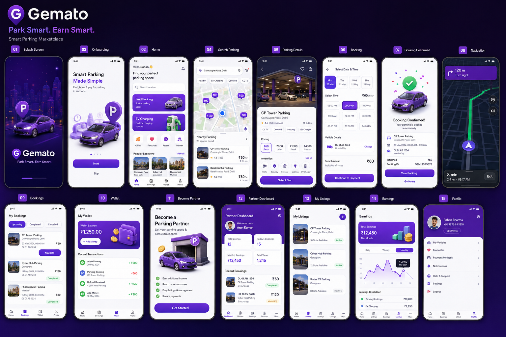
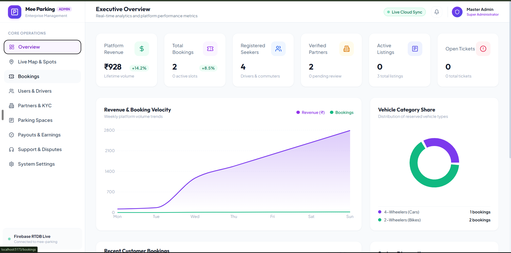

# 🅿️ Mee Parking – Smart Parking Marketplace & Admin Ecosystem

> **"Park Smart. Earn Smart. Manage Intelligently."**  
> A complete, production-ready full-stack ecosystem featuring a **Flutter Mobile Application** for drivers & parking hosts, and a **React + Vite + TypeScript Web Admin Portal** connected to **Firebase Realtime Database** and **Mapbox GL 3D Vector Engine**.

---

## 📸 Platform Overview

### 📱 1. Mobile Flutter Application (Drivers & Parking Hosts)


### 💻 2. React + Vite Web Admin Portal (Management & 3D Radar)


---

## 🌟 Core Modules & Capabilities

### 📱 1. Flutter Mobile Application (`lib/`)
- **01 Splash & Onboarding**: Animated gradient skyline, Mee Parking logo animation, indicator sliders.
- **02 Authentication & Profiles**: Email/Password login, vehicle registration, driver & partner profile toggle.
- **03 Search & Map Navigation**: Interactive Mapbox pins (`₹40`, `₹60`, `₹80`), EV charger filters, distance calculations.
- **04 Slot Booking & Reservation**: Dynamic date selector, time slot grid, prepaid wallet & Razorpay checkout, animated booking confirmation.
- **05 Turn-by-Turn GPS HUD**: Route polyline, compass HUD, ETA and distance readout, live rerouting.
- **06 Face-to-Face Video & Chat**: Full-screen video calling HUD (PiP camera, mute, switch camera) and driver-host realtime chat messaging.
- **07 Partner Business Engine**: Onboarding wizard, parking lot capacity manager (`currentCars`, `currentBikes`), live revenue charts, and instant bank payout requests.

---

### 💻 2. React + Vite Web Admin Dashboard (`admin-panel/`)
- **📊 Executive KPI Analytics (`/`)**:
  - Real-time Gross Revenue, Total Bookings, Active Parking Slots, Registered Drivers, and Verified Partners.
  - Revenue & booking velocity Area Chart + Vehicle Category Donut Chart.
  - Real-time incoming reservations activity stream.
- **🗺️ Mapbox 3D Extruded Live Parking Radar (`/map`)**:
  - True **3D Extruded Polygon Lots** (8m–32m height) & 3D city buildings.
  - **Dynamic Green Pointer**: Active/opened listings turn into a glowing green pointer with an animated pulse ring.
  - **Floating Hover & Inspect Card**: High-res photos, real-time availability gauge, hourly tariffs, and manager phone.
  - **Direct Comms**: One-click **"Call Host"** (live voice call dialer) & **"Live Chat"** modal.
  - 3D Isometric View & 360° Camera Orbit controls.
- **🎟️ Master Bookings Directory (`/bookings`)**:
  - Filterable reservations table with vehicle details, payment IDs, and pricing breakdown.
  - **1-Click Cancellation & Wallet Refund**: Automatically marks status and refunds funds to customer's wallet.
  - **Permanent Delete / Purge**: Admin override to permanently remove test/disputed records.
- **👥 Drivers & Seekers Directory (`/users`)**:
  - Registered vehicle badges, total bookings, and direct **Wallet Balance Adjustments (Credit/Debit)** with audit trail.
  - 1-click **Suspend / Reactivate User Account**.
- **🏢 Auto-Approved Partner Hub (`/partners`)**:
  - Partner accounts are **auto-approved upon sign-up** so hosts can immediately configure their profile and submit listings.
  - Host directory, bank account details, and direct links to review their submitted parking listings.
- **🅿️ Parking Listings Review & Approval Gatekeeper (`/listings`)**:
  - **Governance Workflow**: All new listings submitted by partners enter the **"Pending Review"** queue and remain hidden from public seekers until approved by an Admin.
  - 1-click **"Approve Listing"** instantly pushes the space live to the public app and 3D map.
  - **"Reject Listing"** with custom feedback reason.
- **💰 Financial Disbursements & Payouts Ledger (`/payouts`)**:
  - Transparent 15% platform commission ledger.
  - 1-click **"Disburse Funds"** with automated reference code generation and partner wallet deduction.
- **🎧 Support & Dispute Resolution (`/support`)**:
  - Ticket management with 1-click **Customer Wallet Compensation Credit**.
- **⚙️ Platform Diagnostics (`/settings`)**:
  - Live Firebase RTDB connection status and platform commission rate configurator.

---

## 🏗️ Project Architecture & Directory Structure

```
meeparking/
├── .env                              # Mapbox, Firebase, Razorpay & Agora API keys
├── designui.png                      # Mobile App UI Design Sheet
├── adminpanal.png                    # Web Admin Dashboard Preview
│
├── admin-panel/                      # React + Vite + TypeScript + Tailwind Admin Web App
│   ├── src/
│   │   ├── config/firebase.ts        # Live Firebase SDK initialization
│   │   ├── services/firebaseService.ts # Realtime streaming & CRUD operations
│   │   ├── types/index.ts            # TypeScript interfaces (Bookings, Spaces, Users, Payouts)
│   │   ├── components/
│   │   │   ├── layout/               # Sidebar, Header, AdminLayout
│   │   │   └── common/               # StatCard, StatusBadge, Modal
│   │   └── pages/
│   │       ├── DashboardPage.tsx     # Executive Overview & Charts
│   │       ├── LiveMapPage.tsx       # Mapbox GL 3D Plotted Parking Radar
│   │       ├── BookingsPage.tsx      # Reservations & Instant Refund Manager
│   │       ├── UsersPage.tsx         # Drivers Directory & Wallet Adjuster
│   │       ├── PartnersPage.tsx      # Auto-Approved Host Hub
│   │       ├── ListingsPage.tsx      # Space Review & Approval Pipeline
│   │       ├── PayoutsPage.tsx       # Financial Ledger & Disbursements
│   │       ├── SupportPage.tsx       # Customer Tickets & Wallet Compensation
│   │       └── SettingsPage.tsx      # Platform Rules & System Diagnostics
│   ├── package.json
│   └── vite.config.ts
│
├── lib/                              # Flutter Mobile Application
│   ├── main.dart                     # App entry point & Theme configuration
│   ├── core/services/                # Firebase RTDB, Mapbox & Wallet services
│   ├── shared/                       # State providers, data models & illustrations
│   └── features/
│       ├── splash/                   # Splash & branding screen
│       ├── home/                     # Explore & driver dashboard
│       ├── search/                   # Map search & filter chips
│       ├── booking/                  # Slot selection & payment checkout
│       ├── navigation/               # Turn-by-turn navigation HUD
│       ├── bookings/                 # Active, completed & cancelled trips
│       ├── wallet/                   # Digital wallet & Razorpay top-up
│       ├── partner/                  # Host dashboard, capacity manager & earnings
│       └── chat/                     # Realtime messaging & face-to-face video calling
│
└── firebase/
    ├── database.rules.json           # Realtime Database Security & Indexing Rules
    └── functions/index.js            # Cloud Functions for counters & push notifications
```

---

## ⚡ How to Run & Develop

### 1. Run the Web Admin Panel (React + Vite)
```bash
cd admin-panel
npm install
npm run dev
```
Open **[http://localhost:5173/](http://localhost:5173/)** in your browser.

---

### 2. Run the Mobile Application (Flutter)
```bash
flutter pub get
flutter run
```

---

## ✅ Quality & Verification Status
- **Flutter Mobile App**: `flutter analyze` passing with 0 errors.
- **Web Admin Panel**: `npm run build` passing with 0 TypeScript/bundling errors.
- **Database Synchronization**: Fully connected to live Firebase Realtime Database (`https://mee-parking-default-rtdb.firebaseio.com`).
